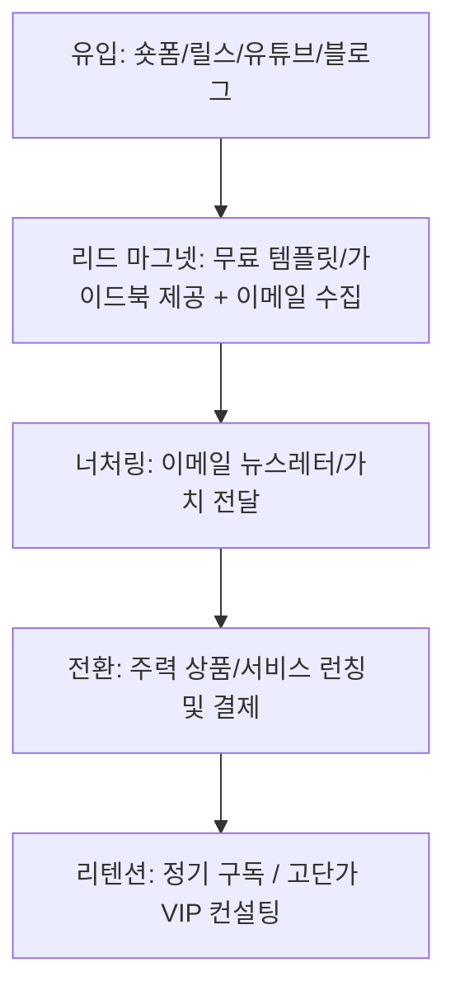

# 💰 1인 AI 기업 수익화 전략 & 비즈니스 모델 템플릿

## 1. 타깃 고객 및 페인 포인트 (Target & Problem)
- **주요 타깃 고객**:
- **고객이 겪는 가장 큰 고통/문제 (Pain Point)**:
- **우리가 제공하는 솔루션 (Unique Value Proposition)**:

---

## 2. 수익 모델 (Monetization Streams)
- [ ] **AI 자동화 서비스 / 외주**: 클라이언트 맞춤형 워크플로우 구축 (월 구독형 또는 건당 청구)
- [ ] **디지털 프로덕트**: 전자책, 템플릿(Notion, Prompt), 자동화 코드 팩 판매
- [ ] **콘텐츠 & 미디어**: 유튜브/블로그 애드센스, 스폰서십, 제휴 마케팅 (Affiliate)
- [ ] **1인 SaaS / 마이크로 서비스**: 월 정기결제(MRR) 기반 소프트웨어 서비스

---

## 3. 세일즈 퍼널 (Conversion Funnel)

---

## 4. 핵심 KPI & 목표 수치
- **월 목표 매출 (MRR)**: 
- **신규 리드 유입 수**: 
- **랜딩페이지 전환율 (CVR)**: 
